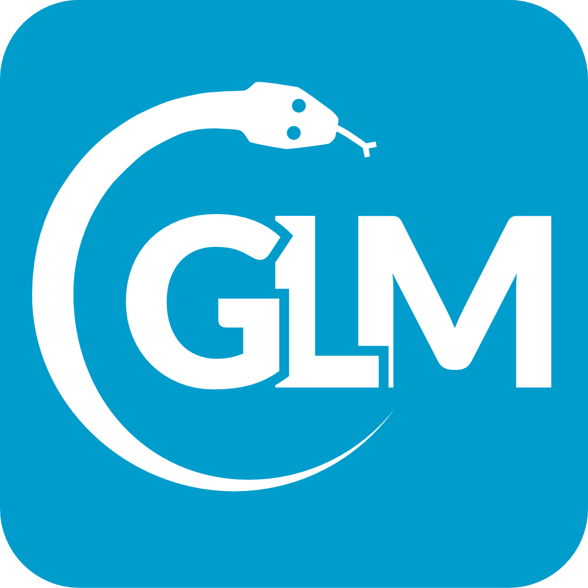
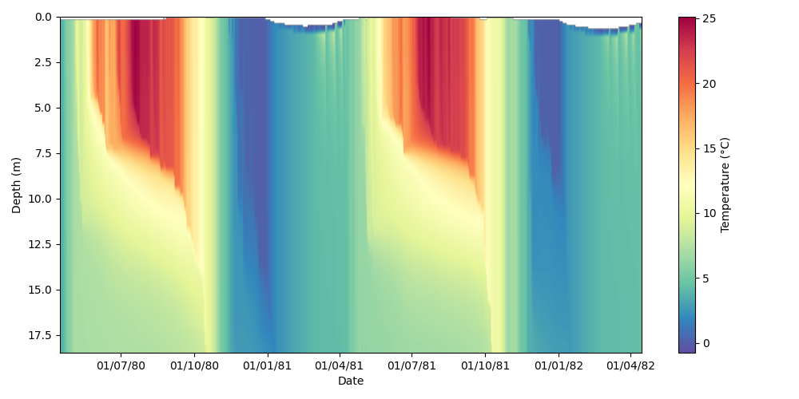

# glm-py 

Python API for the General Lake Model (GLM).

## GLM

GLM is a 1-dimensional lake water balance and stratification model. It can also be coupled with the <a href="https://github.com/AquaticEcoDynamics/aed-science" target="_blank">AED</a> modelling library to support simulations of lake water quality and ecosystem processes.

GLM is suitable for a wide range of natural and engineered lakes, including shallow (well-mixed) and deep (stratified) systems. The model has been successfully applied to systems from the scale of individual ponds and wetlands to the scale of Great Lakes.

For more information about running GLM, please see the model website's <a href="https://aed.see.uwa.edu.au/research/models/glm/overview.html" target="_blank">scientific basis description</a> and the <a href="https://aquaticecodynamics.github.io/glm-workbook/" target="_blank">GLM workbook</a>. 

The <a href="https://github.com/AquaticEcoDynamics/glm-aed/tree/main/binaries" target="_blank">GLM model</a> is available as an executable for Linux (Ubuntu), MacOS, and Windows. It is actively developed by the 
[Aquatic EcoDynamics](https://github.com/AquaticEcoDynamics) research group at The University of Western Australia.

## Why glm-py?

glm-py is an object-oriented API for preparing GLM inputs, running simulations, and processing outputs. 

Its goal is to make working with GLM as easy as possible while providing sufficient depth to meet more complex use cases. At its most basic, a GLM simulation can be run and visualised in just a few lines of code:

```python
import matplotlib.pyplot as plt

from glmpy.plots import NCPlotter
from glmpy.simulation import GLMSim


outputs = GLMSim.from_example_sim("sparkling_lake").run()

nc = NCPlotter(outputs.get_netcdf_path())

fig, ax = plt.subplots(figsize=(10, 5))
profile = nc.plot_profile(ax=ax, var_name="temp")
fig.colorbar(profile).set_label("Temperature (°C)")
```


The API is designed to be interoperable with existing GLM workflows and easily extendable by users. glm-py can be used for running GLM simulations within local Python environments, running batches of GLM simulations on HPCs, or for interfacing with web applications/cloud services that use GLM.

