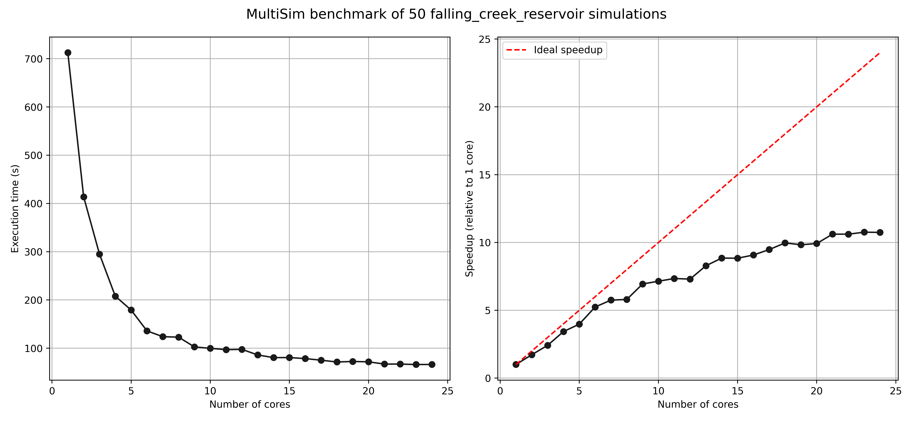
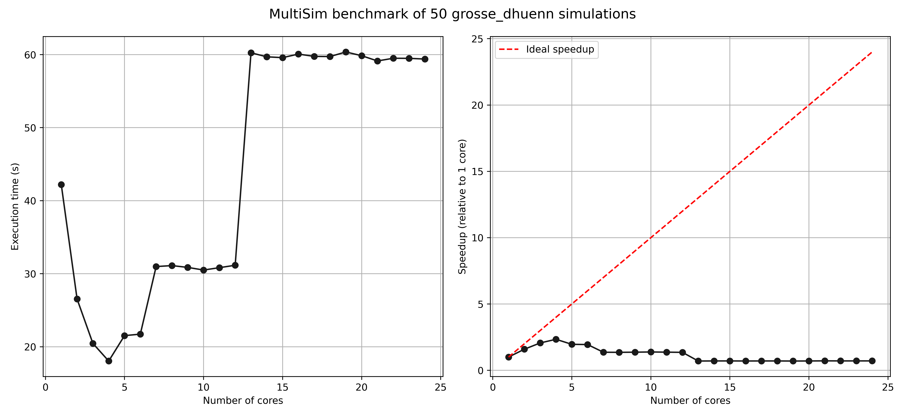
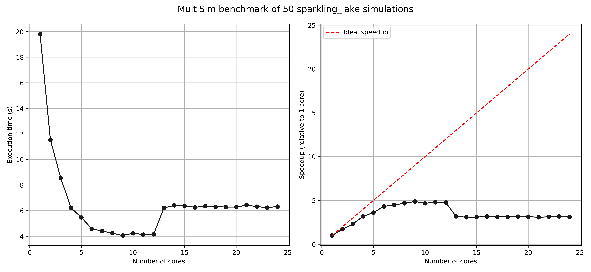
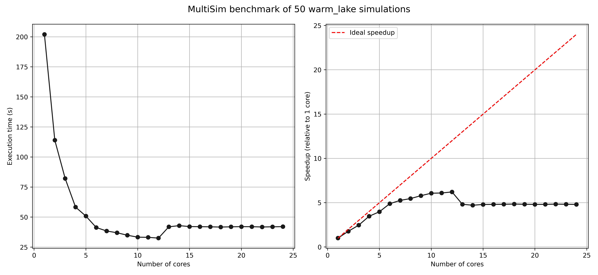
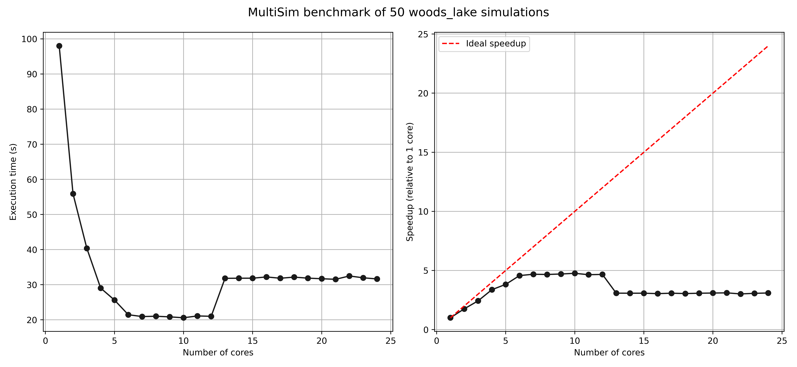

# Getting the most out of `MultiSim`

When looking to run many permutations of a simulation, using 
`MultiSim` to run GLM in parallel across all available CPU cores would 
appear to be a no-brainer. 
However, running many separate processes does not always translate into 
a faster total execution time, and in some cases, actively harms it.
This tutorial will demonstrate the type of scenarios that `MultiSim` 
works best for so you can achieve optimal multi-processing performance.

<!-- more -->

To illustrate good and bad `MultiSim` performance, let's run a 
benchmark of the five example simulations included in glm-py:

```python
from glmpy import simulation as sim


print(sim.GLMSim.get_example_sim_names())
```

```
['falling_creek_reservoir', 'sparkling_lake', 'woods_lake', 'warm_lake', 'grosse_dhuenn']
```

## Methods

For each simulation, the execution time of running 50 permutations will 
be measured. We'll repeat this process on an increasing number of CPU 
cores—starting from 1 core and up to a maximum of 24. The five 
different simulations each vary in duration and complexity—some are a 
quick GLM water balance while others have more computationaly demanding 
AED water quality modules enabled. The timed results will be used to 
determine the speedup factor of using more cores compared to the single 
core baseline.

You can run this benchmark yourself using the script provided at the 
end of the tutorial. Note, your results will vary due to hardware 
differences. The results below are from a machine with a 13th Gen 
i9-13900K CPU and 128 GB of RAM. 

## Results

Plots of the execution time for each number of CPU cores, and the 
speedup factor that it provides, are shown below. 
Each simulation shows a near halving in time to run 50 permutations 
when moving from 1 to 2 CPU cores.
By 4 cores the total execution time has declined substantially despite
the relative speedup factor beginning to decay.
At 5 cores things start to get interesting.
`grosse_dhuenn`'s total execution time has gone backwards and now 
exceeds the runtime on 3 cores.
By 7 cores its worser still.
Meanwhile, the execution time of `sparkling_lake`, `woods_lake`, and 
`warm_lake` have marginally improved and a clear lower limit is 
emerging.
Once 13 cores are in play, these 3 lakes are all worse off than earlier.
At this point, `MultiSim` is now returning worse performance for 
`grosse_dhuenn` than running each permutation sequentially.
Only `falling_creek_reservoir` has continued to reduce execution time 
and does so up to 24 cores—albeit with diminishing returns.







## Benchmarking script

If you would like to benchmark `MultiSim` on your own machine, run the 
script used for this tutorial:

```python
import os
import time
import random
import numpy as np
import matplotlib.pyplot as plt

from glmpy import simulation as sim


def on_sim_end(glm_sim: sim.GLMSim, glm_outputs: sim.GLMOutputs):
    wq_pd = glm_outputs.get_csv_pd("lake")
    mean_min_temp = wq_pd["Min Temp"].mean()
    kw = glm_sim.get_param_value("glm", "light", "kw")
    glm_sim.rm_sim_dir()
    return (glm_sim.sim_name, round(kw, 3), round(mean_min_temp, 3))


def run_with_cores(glm_sims, cpu_count):
    """
    Run sims with specified CPU count and return execution time in seconds.
    """
    multi_sim = sim.MultiSim(glm_sims=glm_sims)
    
    start_time = time.perf_counter()
    
    outputs = multi_sim.run(
        on_sim_end=on_sim_end,
        cpu_count=cpu_count,
        write_log=False,  
        time_sim=False,  
        time_multi_sim=False 
    )
    
    end_time = time.perf_counter()
    execution_time = end_time - start_time
    
    return execution_time, outputs


if __name__ == '__main__':
    os.makedirs("results", exist_ok=True)

    print("glm-py MultiSim Performance Benchmark")
    print("=" * 40)
    
    random.seed(42)
    lake = "sparkling_lake" 
    glm_sim = sim.GLMSim.from_example_sim(lake)
    num_sims = 50

    print(f"Preparing {num_sims} simulations...")
    glm_sims = []
    for i in range(num_sims):
        random_sim = glm_sim.get_deepcopy()
        random_sim.sim_name = f"sim_{i}"
        kw = random.random()
        random_sim.set_param_value("glm", "light", "kw", kw)
        glm_sims.append(random_sim)
    
    max_cores = min(24, sim.MultiSim.cpu_count())
    results = []
    
    print(f"Running benchmarks from 1 to {max_cores} cores...")
    print(f"{'Cores':<6}{'Time (s)':<10}{'Speedup (x)':<10}")
    print("-" * 40)
    
    baseline_time, _ = run_with_cores(glm_sims, 1)
    results.append((1, baseline_time, 1.0))
    print(f"{1:<6}{baseline_time:<10.2f}{1.0:<10.2f}")
    
    for cores in range(2, max_cores + 1):
        execution_time, _ = run_with_cores(glm_sims, cores)
        speedup = baseline_time / execution_time
        results.append((cores, execution_time, speedup))
        print(f"{cores:<6}{execution_time:<10.2f}{speedup:<10.2f}")
    
    cores, times, speedups = zip(*results)
    
    fig, axs = plt.subplots(nrows=1, ncols=2, figsize=(13, 6))
    axs[0].plot(cores, times, 'o-', color='#1a1a1a')
    axs[0].set_xlabel('Number of cores')
    axs[0].set_ylabel('Execution time (s)')
    axs[0].grid(True)
    axs[1].plot(cores, speedups, 'o-', color='#1a1a1a')
    axs[1].plot(cores, cores, '--', color='red', label='Ideal speedup')
    plt.legend()
    axs[1].set_xlabel('Number of cores')
    axs[1].set_ylabel('Speedup (relative to 1 core)')
    fig.suptitle(f"MultiSim benchmark of {num_sims} {lake} simulations", fontsize=14)
    axs[1].grid(True)
    plt.tight_layout()
    fig.savefig(f'results/multisim_benchmark_{lake}_{num_sims}.png', dpi=500)
    print(
        f"\nPlot saved to results/multisim_benchmark_{lake}_{num_sims}.png"
    )
    
    optimal_cores = cores[np.argmax(speedups)]
    print(f"\nOptimal core count: {optimal_cores} (speedup: {max(speedups):.2f}x)")
    
    with open(
        f'results/multisim_benchmark_{lake}_{num_sims}_results.csv', 'w'
    ) as f:
        f.write('cores,time_seconds,speedup\n')
        for core, time_sec, speedup in results:
            f.write(f'{core},{time_sec:.4f},{speedup:.4f}\n')
    print(
        f"Results saved to multisim_benchmark_{lake}_{num_sims}_results.csv"
    )
```